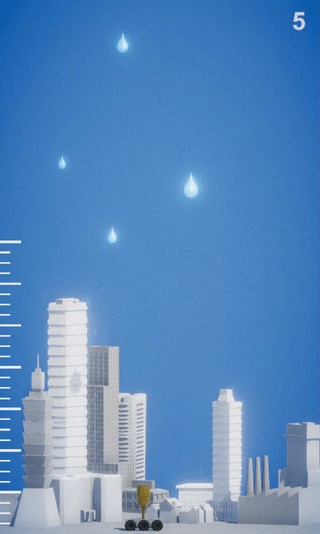

# UnityDemo_RainSlayer

    

A simple space invaders-like demo made for [Nolaroads](https://www.nolaroads.com/).

Rain is flooding the city, and your weapon is the only way to stop it.
You can move left and right, change your height with a scrollwheel and shoot with a left click.
On the left of the screen, there is a ruler showing the flood level. It must not become critical!
